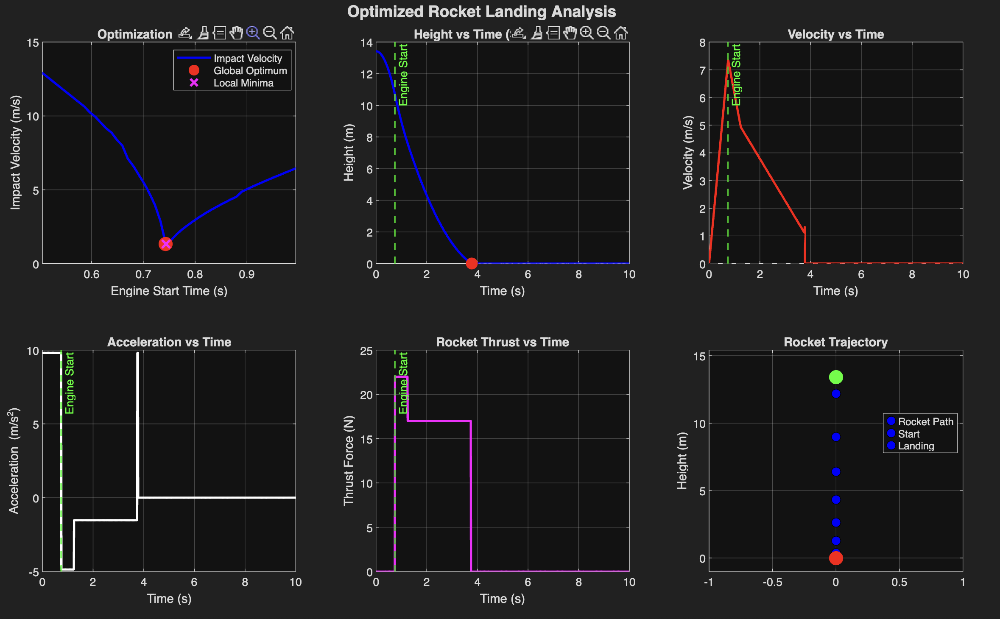

# Telluris Landing Simulation

Telluris Landing Simulation using MATLAB

## Overview
MATLAB simulation of when to fire 2nd stage engine. Force of rocket over time modeled to fit: https://estesrockets.com/products/f15-4-engines?srsltid=AfmBOopKaNhyDcEByrfRHtOX5CfD1Tsoa0LnAzC-BleU620qlZIWCuKe

## Limitations

The simulation currently does **not** account for:
- Aerodynamic drag
- Horizontal drift or wind effects
- Rocket tumbling or off-axis orientation
- Variable atmospheric conditions
- Engine gimbal control or thrust vectoring

### Timing Sensitivity

The optimization landscape (upper left) demonstrates the **critical importance of precise timing**. Small variations in engine start time (±0.1s) can result in impact velocity changes of several m/s. This sensitivity means:

1. millisecond-level accuracy required
2. altitude measurements must be reliable
3. **Unknown disturbances** (drag, drift, orientation) could significantly affect landing outcome

### Angle Tilt Problem

The rocket could tilt at an offset angle from the vertical orientation when it is at its peak height and there is no tvc stabilization. This could in turn lead to 2 outcomes:

1. **Reduced effective thrust**: When the rocket is tilted at angle $\theta$ from vertical, only the vertical component of thrust contributes to deceleration:

$$F_{\text{effective}}(t) = F_{\text{thrust}}(t) \cos(\theta)$$

2. **Lateral drift**: The horizontal component of thrust, $F_{\text{thrust}}(t) \sin(\theta)$, causes the rocket to drift laterally. This drift moves the landing point away from the target
